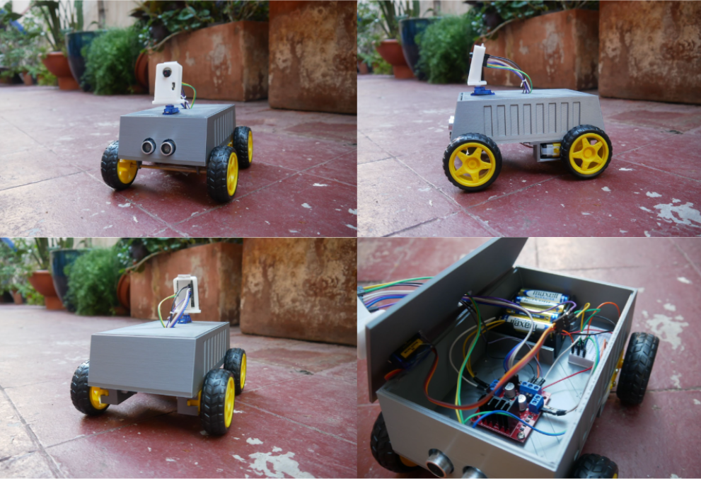

# ESP32-Cam AI Robot (YOLOv8 + Web Control)

A dual-mode RC robot powered by an **ESP32-Cam** and **YOLOv8**. This project features a web-based manual control dashboard and an autonomous "Follow Person" mode processing Computer Vision on a host PC.

<p align="center">
  
</p>

## Features
* **Live MJPEG Streaming:** Low-latency video feed over WiFi.
* **Computer Vision Integration:** Python script uses YOLOv8 to detect humans and steer the car automatically.
* **Web Dashboard:** Mobile-friendly UI to control Speed, Direction, Camera Angle (Servo), and Flashlight.
* **Safety System:** Ultrasonic sensor (HC-SR04) automatically triggers emergency stops within 20cm of obstacles.

## Hardware Required
* **Microcontroller:** ESP32-CAM (AI-Thinker Model)
* **Chassis:** 2WD or 4WD Robot Chassis
* **Motor Driver:** L298N or L293D
* **Camera Gimbal:** Micro Servo (SG90)
* **Sensors:** Ultrasonic Sensor (HC-SR04)
* **Power:** 2x 18650 Li-ion batteries (or similar 7.4V supply)

## Wiring Pinout
| Component | Pin Function | ESP32 GPIO |
| :--- | :--- | :--- |
| **Motor Driver** | Input 1 (Left A) | GPIO 12 |
| | Input 2 (Left B) | GPIO 13 |
| | Input 3 (Right A) | GPIO 14 |
| | Input 4 (Right B) | GPIO 15 |
| **Servo** | PWM Signal | GPIO 2 |
| **Ultrasonic** | Trigger | GPIO 1 |
| | Echo | GPIO 3 |
| **Flashlight** | Built-in LED | GPIO 4 |

**Note:** Since GPIO 1 & 3 are Serial pins, you must disconnect the Ultrasonic sensor while uploading code to the ESP32.

## Installation

### 1. Firmware (ESP32)
1.  Open `Firmware/ESP32_Cam_Robot.ino` in Arduino IDE.
2.  Install the **ESP32 Board Manager** (Expressif Systems).
3.  Select Board: **AI Thinker ESP32-CAM**.
4.  Change the `ssid` and `password` variables if you want to connect to a router (Default creates a hotspot: `ESP32-Cam-Robot`).
5.  Upload the code.

### 2. Software (PC)
1.  Install Python 3.8+.
2.  Install dependencies:
    ```bash
    pip install -r Computer_Vision/requirements.txt
    ```
3.  Connect your PC to the ESP32's WiFi (`ESP32-Cam-Robot`).
4.  Run the AI script:
    ```bash
    python Computer_Vision/main.py
    ```

## Controls

### Web Dashboard
* **Sliders:** Adjust Motor Speed (120-255) and Camera Servo Angle.
* **Buttons:** Toggle Flashlight, Manual Driving.

### AI Mode (Python)
* **Spacebar:** Toggle "Person Follow" mode.
* **Tab:** To follow person with the whole car or only servomotor.
* **Esc:** Exit program.

